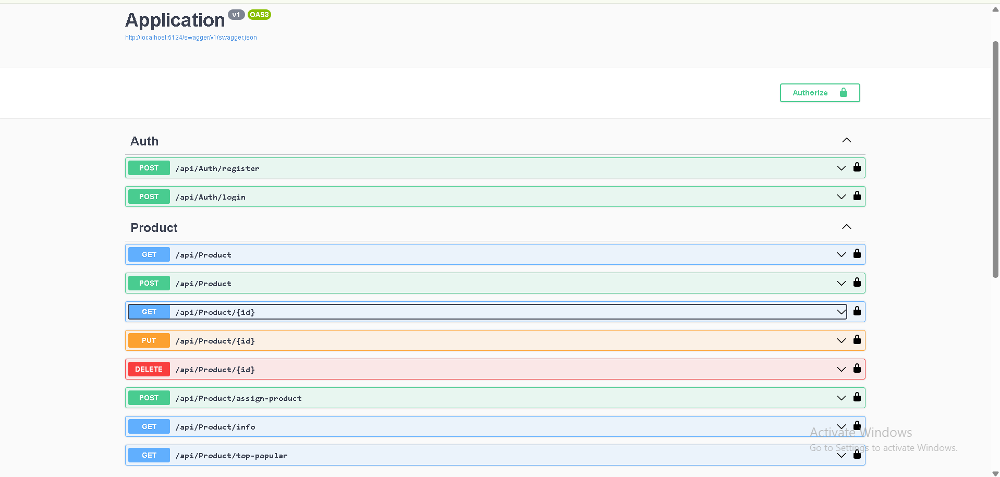

# ProductHub API

**ProductHub API** is a layered ASP.NET Core REST API for managing user-owned products, secure product assignment, and product analytics. It solves the common backend problem of combining authentication, ownership-aware CRUD operations, and reporting endpoints in a clean, maintainable architecture that separates API, business logic, and data access concerns.



## Tech Stack

- **Language:** C# 12
- **Framework:** ASP.NET Core Web API (.NET 8)
- **Architecture:** Layered solution with API, Business Logic Layer, and Data Access Layer projects
- **Database:** SQLite
- **ORM:** Entity Framework Core 8
- **Authentication:** JWT Bearer authentication
- **Validation:** FluentValidation
- **API Documentation:** Swagger / OpenAPI via Swashbuckle
- **Tooling:** Visual Studio, .NET CLI, EF Core migrations

## Key Features

- **JWT-based authentication** with secure registration and login endpoints.
- **Password hashing and verification** to avoid storing raw user passwords.
- **Protected product API** where product endpoints require a valid bearer token.
- **Ownership-aware product management** for creating, reading, updating, and deleting products by authenticated users.
- **User-product assignment workflow** for tracking which products are associated with which users.
- **Product analytics endpoints** for total product count, average price, lowest price, highest price, and total assigned products.
- **Top popular products reporting** based on product assignment frequency.
- **DTO-based request/response contracts** that keep API models focused and readable.
- **Centralized validation rules** for user registration and product create/update requests.
- **Swagger UI integration** for easy API exploration and manual testing.

## Getting Started / How to Run Locally

### Prerequisites

Make sure the following tools are installed:

- [.NET 8 SDK](https://dotnet.microsoft.com/download/dotnet/8.0)
- Git
- Optional: Visual Studio 2022 or another C# IDE

### 1. Clone the Repository

```bash
git clone <your-repository-url>
cd REST-API1
```

### 2. Restore Dependencies

```bash
dotnet restore Praksa2.sln
```

### 3. Configure Local Settings

The API reads its database connection string and JWT settings from configuration. For local development, keep secrets out of source control by using .NET user secrets or environment variables.

From the API project directory:

```bash
cd Praksa2
dotnet user-secrets init
dotnet user-secrets set "Jwt:Key" "replace-with-a-long-random-development-secret"
dotnet user-secrets set "Jwt:Issuer" "http://localhost:5124"
dotnet user-secrets set "Jwt:Audience" "http://localhost:5124"
dotnet user-secrets set "ConnectionStrings:DefaultConnection" "Data Source=products.db"
```

Example `appsettings.Development.json` shape:

```json
{
  "Jwt": {
    "Key": "replace-with-a-long-random-development-secret",
    "Issuer": "http://localhost:5124",
    "Audience": "http://localhost:5124"
  },
  "ConnectionStrings": {
    "DefaultConnection": "Data Source=products.db"
  },
  "AppSettings": {
    "DefaultTopCount": 10
  }
}
```

### 4. Apply Database Migrations

Run the EF Core migrations from the repository root:

```bash
dotnet ef database update --project Praksa2
```

If the `dotnet ef` command is not available, install the EF Core CLI tool:

```bash
dotnet tool install --global dotnet-ef
```

Then run the database update command again.

### 5. Start the API

From the repository root:

```bash
dotnet run --project Praksa2
```

The API will start at:

```text
http://localhost:5124
```

Swagger UI is available at:

```text
http://localhost:5124/swagger
```

## API Overview

### Authentication

- `POST /api/Auth/register` - Register a new user.
- `POST /api/Auth/login` - Authenticate and receive a JWT token.

### Products

All product endpoints require an `Authorization: Bearer <token>` header.

- `GET /api/Product` - Get products assigned to the authenticated user.
- `GET /api/Product/{id}` - Get a product by ID.
- `POST /api/Product` - Create a new product.
- `PUT /api/Product/{id}` - Update an existing product owned by the authenticated user.
- `DELETE /api/Product/{id}` - Delete a product owned by the authenticated user.
- `POST /api/Product/assign-product` - Assign a product to a user.
- `GET /api/Product/info` - Retrieve product summary statistics.
- `GET /api/Product/top-popular?topCount=10` - Retrieve the most frequently assigned products.

## Solution Structure

```text
REST-API1/
+-- Praksa2/                  # ASP.NET Core Web API project
|   +-- Controllers/          # Auth and product endpoints
|   +-- Migrations/           # API startup migration history
|   +-- Program.cs            # Dependency injection, auth, Swagger, middleware
+-- BusinessLogicLayer/       # Services, DTOs, validation rules
|   +-- Dtos/
|   +-- Services/
|   +-- Validators/
+-- DataAccessLayer/          # EF Core DbContext, models, repositories
|   +-- Data/
|   +-- Models/
|   +-- Repositories/
|   +-- Migrations/
+-- Praksa2.sln               # Visual Studio solution
```

## Development Notes

- The application uses SQLite by default, which keeps local setup lightweight.
- Swagger is enabled in the Development environment for fast endpoint testing.
- Product routes are protected with JWT Bearer authentication.
- Request validation is handled with FluentValidation before data reaches the service layer.
